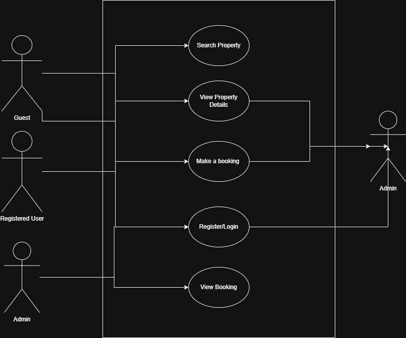

## Requirement Analysis in Software Development

# What is Requirement Analysis?

Requirement Analysis is the process of identifying, documenting, and validating the needs and expectations of stakeholders for a new or altered product. It’s one of the foundational steps in the Software Development Life Cycle (SDLC). This phase ensures that everyone involved in the project—from clients and end-users to developers and testers—has a shared understanding of what the software should do and how it should behave.

Without a clear understanding of the requirements, projects are at risk of misalignment, scope creep, budget overruns, and ultimately, failure. Requirement Analysis bridges the gap between business needs and technical implementation.

---

# Why is Requirement Analysis Important?

Requirement Analysis is a critical step in any software project for several reasons:

- **Clarity and Shared Understanding**  
  It helps ensure that the development team, stakeholders, and users have a clear, mutual understanding of what needs to be built.

- **Reduces Rework and Costs**  
  Early identification of requirements and potential issues helps avoid costly changes and rework later in the development cycle.

- **Improves Planning and Estimation**  
  With clearly defined requirements, it becomes much easier to estimate time, cost, and resources needed for the project.

---

# Key Activities in Requirement Analysis

Requirement Analysis is more than just collecting information; it involves several critical activities that work together to shape the final product:

- **Requirement Gathering**  
  This involves collecting high-level needs from stakeholders through interviews, surveys, or documentation reviews.

- **Requirement Elicitation**  
  In this phase, deeper insights are drawn from stakeholders through workshops, brainstorming sessions, and use case discussions.

- **Requirement Documentation**  
  All the gathered and elicited information is formally recorded in documents such as the Software Requirements Specification (SRS).

- **Requirement Analysis and Modeling**  
  This step involves organizing, prioritizing, and representing the requirements through models like use cases, flow diagrams, or ER diagrams.

- **Requirement Validation**  
  The documented requirements are verified with stakeholders to ensure accuracy, completeness, and feasibility before proceeding to development.

---

# Types of Requirements

## Functional Requirements

Functional Requirements describe the **core functionality** of the system—what the system should do.

**Examples for Booking Management Project:**

- Users can search for available properties based on location, price, and date.
- The system allows users to register, log in, and manage profiles.
- A booking form is available on each listing detail page to initiate a reservation.
- Users can securely pay through an integrated checkout process.

## Non-functional Requirements

Non-functional Requirements describe **how** the system performs under various conditions. These are often related to performance, security, scalability, and usability.

**Examples for Booking Management Project:**

- The system should respond to user actions within 2 seconds.
- All payment transactions must be encrypted using SSL.
- The application should be accessible on both desktop and mobile devices.
- User data should be backed up daily and stored securely.

---

# Use Case Diagrams

Use Case Diagrams are visual representations of the interactions between system users (actors) and the system itself (use cases). They help identify system boundaries and the functionality that needs to be delivered.

They are particularly useful during Requirement Analysis because:

- They simplify complex interactions into a readable format.
- They help identify all possible scenarios and edge cases.
- They foster communication between technical and non-technical team members.

**Use Case Diagram for the Booking System**

Actors:
- Guest
- Registered User
- Admin

Use Cases:
- Search Property
- View Property Details
- Make a Booking
- Process Payment
- Register/Login
- Manage Listings (Admin)
- View Bookings

---

# Acceptance Criteria

Acceptance Criteria are the predefined conditions that a feature must meet to be accepted by stakeholders or the client. They help to:

- Set clear expectations for functionality and performance.
- Guide testing efforts and user story validation.
- Prevent misunderstandings between developers and stakeholders.

**Example: Checkout Feature**

- The user must be logged in to access the checkout.
- The selected booking details (dates, guest count, price) must be displayed.
- The system must validate payment information before processing.
- A booking confirmation page must be shown after successful payment.
- If payment fails, the user must receive an appropriate error message.

---

